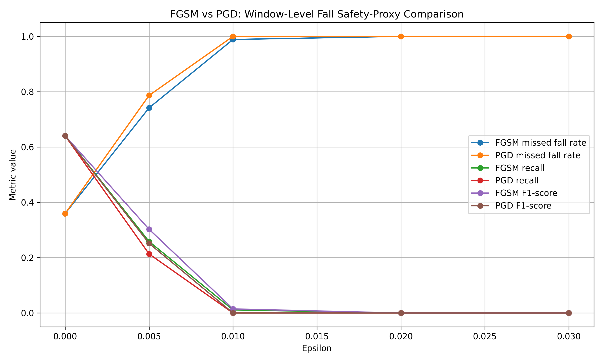
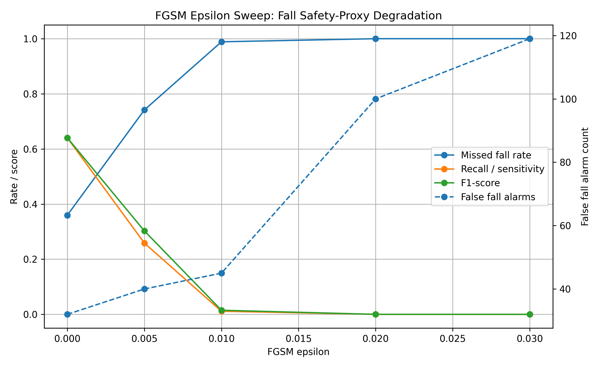
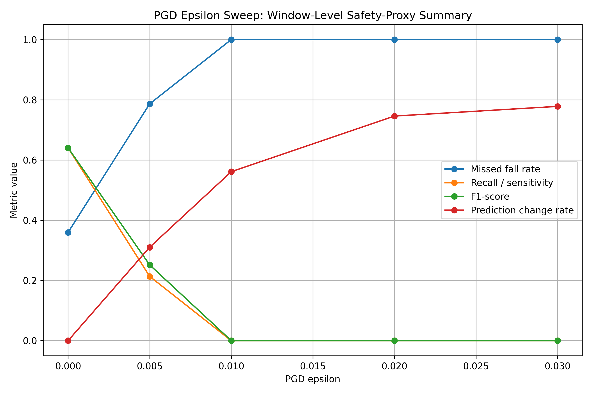

# WiFi CSI Fall Attack-Safety Demo

A reproducible research implementation for evaluating how adversarial perturbations affect WiFi CSI fall-related activity recognition and fall-focused safety-proxy metrics.

This repository compares a clean WiFi CSI activity-recognition baseline with software-level FGSM and PGD adversarial perturbations, then translates model degradation into window-level fall-vs-non-fall safety-proxy metrics such as missed-fall rate, false fall alarms, recall, precision, F1-score, balanced accuracy, and prediction change rate.

---

## 1. Project Summary

This repository is a standalone portfolio/research version of the Fall Detection Attack-Safety Demo originally developed inside the larger `secure-wifi-csi-healthcare-sensing` research repository.

The goal is to make the completed demo more visible as an independent GitHub project while preserving the original version inside the larger thesis/research repository.

Full research repository:

```text
https://github.com/shahram-h-hesari/secure-wifi-csi-healthcare-sensing
```

Standalone project focus:

```text
WiFi CSI sensing
fall-related activity recognition
adversarial machine learning
FGSM attack
PGD attack
FGSM adversarial training defense
fall-vs-non-fall safety-proxy metrics
research reproducibility
```

---

## 2. Research Motivation

Many WiFi CSI sensing and adversarial machine learning studies report technical metrics such as model accuracy, F1-score, attack success rate, or classification error.

This project asks a more safety-oriented question:

```text
If a WiFi CSI fall-related activity-recognition model is degraded by adversarial perturbation,
does it miss more fall windows, create more false fall alarms, reduce recall,
reduce F1-score, or become less stable?
```

The central translation pathway is:

```text
WiFi CSI sensing output
-> ML prediction
-> clean or attacked prediction error
-> fall-vs-non-fall safety-proxy metric
-> adversarial safety degradation
```

The goal is not to claim clinical validation. The goal is to build a reproducible research workflow that converts model outputs into safety-proxy metrics that are easier to interpret for healthcare-relevant sensing research.

---

## 3. Current Status

```text
Clean SenseFi UT-HAR LeNet baseline completed.
Clean prediction export completed.
Clean fall-vs-non-fall safety-proxy metrics completed.
FGSM attacked prediction export completed.
FGSM fall-vs-non-fall safety-proxy metrics completed.
FGSM epsilon sweep completed.
FGSM epsilon sweep figures completed.
PGD attacked prediction export completed.
PGD fall-vs-non-fall safety-proxy metrics completed.
PGD epsilon sweep completed.
PGD epsilon sweep figures completed.
FGSM vs PGD comparison completed.
Final FGSM/PGD attack-safety lab report completed.
Window-level vs event-level limitation note completed.
FGSM adversarial training defense baseline completed.
```

This is a research implementation demo. It is not clinical validation, medical-device validation, real patient deployment, diagnostic evidence, regulatory evaluation, physical-layer attack validation, SDR validation, packet-level validation, preamble-level validation, event-level fall validation, long-lie validation, or over-the-air validation.

---

## 4. Dataset and Model

This first baseline uses SenseFi / WiFi-CSI-Sensing-Benchmark with the UT-HAR dataset and LeNet model.

| Item | Current Choice |
|---|---|
| Benchmark | SenseFi / WiFi-CSI-Sensing-Benchmark |
| Dataset | UT_HAR_data |
| Model | LeNet |
| Device | CPU |
| Short baseline epochs | 5 |
| Original SenseFi setting | 200 epochs |
| Prediction split | SenseFi validation + test loader |
| Prediction rows | 996 |
| Dataset storage | Local only, not committed to GitHub |
| Third-party benchmark clone | Local only, ignored by Git |

The shortened 5-epoch run is used for reproducibility testing and pipeline development. It should not be interpreted as final benchmark performance.

---

## 5. UT-HAR Label Mapping

UT-HAR contains seven activity classes:

```text
0 = lie down
1 = fall
2 = walk
3 = pickup
4 = run
5 = sit down
6 = stand up
```

For the safety-proxy layer, the labels are mapped into binary fall-vs-non-fall labels:

```text
fall = class 1
non-fall = classes 0, 2, 3, 4, 5, 6
```

---

## 6. Completed Implementation Milestones

| Milestone | Status | Main Files |
|---|---|---|
| SenseFi smoke test | Complete | `scripts/run_sensefi_smoke_test.py`, `notes/smoke_test_log.md` |
| Short clean baseline | Complete | `scripts/run_sensefi_clean_baseline_short.py`, `results/clean_baseline_short_metrics.csv`, `notes/clean_baseline_short_log.md` |
| Clean prediction export | Complete | `scripts/export_clean_predictions_short.py`, `results/clean_predictions_short.csv` |
| Clean safety-proxy metrics | Complete | `scripts/compute_clean_safety_metrics.py`, `results/clean_safety_proxy_metrics.csv`, `notes/clean_safety_proxy_metrics_log.md` |
| FGSM attacked prediction export | Complete | `scripts/export_fgsm_predictions_short.py`, `results/fgsm_predictions_short_epsilon_0_03.csv` |
| FGSM safety-proxy metrics | Complete | `scripts/compute_fgsm_safety_metrics.py`, `results/fgsm_safety_proxy_metrics_epsilon_0_03.csv`, `notes/fgsm_safety_proxy_metrics_log.md` |
| FGSM epsilon sweep | Complete | `scripts/run_fgsm_epsilon_sweep_short.py`, `results/fgsm_epsilon_sweep_summary.csv`, `notes/fgsm_epsilon_sweep_log.md` |
| FGSM epsilon sweep figures | Complete | `scripts/plot_fgsm_epsilon_sweep.py`, `scripts/plot_fgsm_epsilon_combined_summary.py`, `figures/fgsm_epsilon_combined_safety_summary.png`, `notes/fgsm_epsilon_sweep_figures_summary.md` |
| PGD attacked prediction export | Complete | `scripts/export_pgd_predictions_short.py`, `results/pgd_predictions_short_epsilon_0_03.csv`, `notes/pgd_prediction_export_log.md` |
| PGD safety-proxy metrics | Complete | `scripts/compute_pgd_safety_metrics.py`, `results/pgd_safety_proxy_metrics_epsilon_0_03.csv`, `notes/pgd_safety_proxy_metrics_log.md` |
| PGD epsilon sweep | Complete | `scripts/run_pgd_epsilon_sweep_short.py`, `results/pgd_epsilon_sweep_summary.csv`, `notes/pgd_epsilon_sweep_log.md` |
| PGD epsilon sweep figures | Complete | `scripts/plot_pgd_epsilon_sweep.py`, `figures/pgd_epsilon_combined_safety_summary.png`, `notes/pgd_epsilon_sweep_figures_summary.md` |
| FGSM vs PGD comparison | Complete | `scripts/plot_fgsm_vs_pgd_comparison.py`, `results/fgsm_vs_pgd_epsilon_comparison.csv`, `figures/fgsm_vs_pgd_safety_comparison.png`, `notes/fgsm_vs_pgd_comparison_summary.md` |
| Final lab report | Complete | `notes/final_fgsm_pgd_attack_safety_lab_report.md` |
| Window-level vs event-level limitation note | Complete | `notes/window_level_vs_event_level_limitations.md` |
| FGSM adversarial training defense | Complete | `scripts/train_fgsm_adversarial_defense_short.py`, `results/fgsm_adversarial_training_short_metrics.csv`, `notes/adversarial_training_defense_plan.md`, `notes/fgsm_adversarial_training_defense_log.md` |

---

## 7. Clean Short Baseline Result

The shortened clean baseline completed successfully.

```text
Epoch 01/5 | train_acc=0.2858, train_loss=1.8020 | test_acc=0.2942, test_loss=1.7874
Epoch 02/5 | train_acc=0.2946, train_loss=1.7870 | test_acc=0.2942, test_loss=1.7805
Epoch 03/5 | train_acc=0.3233, train_loss=1.7412 | test_acc=0.4207, test_loss=1.6117
Epoch 04/5 | train_acc=0.4919, train_loss=1.4322 | test_acc=0.5161, test_loss=1.2782
Epoch 05/5 | train_acc=0.6142, train_loss=1.0603 | test_acc=0.6596, test_loss=1.0014
```

The model improved from approximately 29% seven-class test accuracy after the first epoch to approximately 66% after five epochs.

---

## 8. Clean Fall-vs-Non-Fall Safety-Proxy Metrics

The clean binary safety-proxy evaluation produced:

```text
Total windows: 996
Fall windows: 89
Non-fall windows: 907

TP / detected falls: 57
FN / missed falls: 32
FP / false fall alarms: 32
TN / correct non-falls: 875

Accuracy: 0.9357
Recall / sensitivity: 0.6404
Missed fall rate: 0.3596
Specificity: 0.9647
False positive rate: 0.0353
Precision: 0.6404
F1-score: 0.6404
Balanced accuracy: 0.8026
```

Note: this binary accuracy is fall-vs-non-fall accuracy, not seven-class activity-recognition accuracy.

---

## 9. FGSM Attack Scope

The FGSM perturbation in this demo is applied to processed CSI tensors inside the model evaluation pipeline.

This experiment evaluates:

```text
processed CSI tensor perturbation
single-step software-level adversarial attack behavior
window-level fall-vs-non-fall safety-proxy degradation
```

It does not evaluate:

```text
physical-layer transmission attack
packet-level attack
preamble-level attack
OFDM waveform attack
SDR attack
over-the-air attack
real-world deployment attack
```

Physical-layer and preamble-based attacks remain part of the literature-grounded threat motivation unless explicitly reproduced in later signal-level or hardware experiments.

---

## 10. FGSM Safety-Proxy Result at Epsilon 0.03

At epsilon 0.03, the FGSM attack produced strong degradation.

Clean binary metrics:

```text
TP / detected falls: 57
FN / missed falls: 32
FP / false fall alarms: 32
TN / correct non-falls: 875

Recall / sensitivity: 0.6404
Missed fall rate: 0.3596
Precision: 0.6404
F1-score: 0.6404
Balanced accuracy: 0.8026
```

FGSM-attacked binary metrics:

```text
TP / detected falls: 0
FN / missed falls: 89
FP / false fall alarms: 119
TN / correct non-falls: 788

Recall / sensitivity: 0.0000
Missed fall rate: 1.0000
Precision: 0.0000
F1-score: 0.0000
Balanced accuracy: 0.4344
```

Clean-to-FGSM safety degradation:

```text
Missed fall rate change: +0.6404
False alarm count change: +87
Recall change: -0.6404
F1-score change: -0.6404
Balanced accuracy change: -0.3682
```

---

## 11. FGSM Epsilon Sweep Summary

The epsilon sweep tested:

```text
epsilon = 0.000
epsilon = 0.005
epsilon = 0.010
epsilon = 0.020
epsilon = 0.030
```

Summary:

```text
epsilon=0.000 | seven_class_acc=0.659639 | missed_fall_rate=0.359551 | false_alarms=32  | recall=0.640449 | f1=0.640449 | prediction_change_rate=0.000000
epsilon=0.005 | seven_class_acc=0.411647 | missed_fall_rate=0.741573 | false_alarms=40  | recall=0.258427 | f1=0.302632 | prediction_change_rate=0.287149
epsilon=0.010 | seven_class_acc=0.238956 | missed_fall_rate=0.988764 | false_alarms=45  | recall=0.011236 | f1=0.014815 | prediction_change_rate=0.483936
epsilon=0.020 | seven_class_acc=0.062249 | missed_fall_rate=1.000000 | false_alarms=100 | recall=0.000000 | f1=0.000000 | prediction_change_rate=0.682731
epsilon=0.030 | seven_class_acc=0.010040 | missed_fall_rate=1.000000 | false_alarms=119 | recall=0.000000 | f1=0.000000 | prediction_change_rate=0.743976
```

The sweep shows that safety-proxy degradation increases as perturbation strength increases. This is stronger than reporting one attack setting only because it shows how missed fall rate, false alarms, recall, F1-score, and prediction instability change across perturbation levels.

---

## 12. PGD Attack Scope

The PGD perturbation in this demo is also applied to processed CSI tensors inside the model evaluation pipeline.

PGD is an iterative adversarial attack. In this implementation, it is applied to processed UT-HAR CSI tensors after data preprocessing.

Unlike FGSM, which applies a single gradient-sign update, PGD applies multiple smaller gradient-based updates and projects the perturbation back inside the allowed epsilon range after each step. This makes PGD a stronger iterative software-level adversarial attack for this research implementation.

This experiment evaluates:

```text
processed CSI tensor perturbation
iterative software-level adversarial attack behavior
window-level fall-vs-non-fall safety-proxy degradation
```

It does not evaluate:

```text
physical-layer transmission attack
packet-level attack
preamble-level attack
OFDM waveform attack
SDR attack
over-the-air attack
real-world deployment attack
```

PGD single-epsilon configuration:

```text
epsilon = 0.030
alpha = 0.005
pgd_steps = 10
epochs = 5
device = CPU
```

---

## 13. PGD Safety-Proxy Result at Epsilon 0.03

At epsilon 0.03, the PGD attack produced strong degradation in the window-level fall-vs-non-fall safety-proxy evaluation.

PGD-attacked binary metrics:

```text
Total windows: 996
Fall windows: 89
Non-fall windows: 907

TP / detected falls: 0
FN / missed falls: 89
FP / false fall alarms: 115
TN / correct non-falls: 792

Seven-class accuracy: 0.0000
Binary accuracy: 0.7952
Recall / sensitivity: 0.0000
Missed fall rate: 1.0000
Specificity: 0.8732
False positive rate: 0.1268
Precision: 0.0000
F1-score: 0.0000
Balanced accuracy: 0.4366
```

Clean-to-PGD safety degradation:

```text
Detected falls decreased from 57 to 0
Missed falls increased from 32 to 89
False fall alarms increased from 32 to 115
Recall decreased from 0.6404 to 0.0000
Missed fall rate increased from 0.3596 to 1.0000
F1-score decreased from 0.6404 to 0.0000
Balanced accuracy decreased from 0.8026 to 0.4366
```

At this epsilon, PGD caused complete loss of fall recall in the window-level binary safety-proxy evaluation.

---

## 14. PGD Epsilon Sweep Summary

The PGD epsilon sweep tested:

```text
epsilon = 0.000
epsilon = 0.005
epsilon = 0.010
epsilon = 0.020
epsilon = 0.030
```

PGD was implemented as a software-level iterative adversarial perturbation applied to processed UT-HAR CSI tensors.

For this sweep:

```text
pgd_steps = 10
alpha = epsilon / 6
epochs = 5
device = CPU
```

Summary:

```text
epsilon=0.000 | seven_class_acc=0.659639 | missed_fall_rate=0.359551 | false_alarms=32  | recall=0.640449 | f1=0.640449 | prediction_change_rate=0.000000
epsilon=0.005 | seven_class_acc=0.389558 | missed_fall_rate=0.786517 | false_alarms=43  | recall=0.213483 | f1=0.251656 | prediction_change_rate=0.310241
epsilon=0.010 | seven_class_acc=0.172691 | missed_fall_rate=1.000000 | false_alarms=70  | recall=0.000000 | f1=0.000000 | prediction_change_rate=0.561245
epsilon=0.020 | seven_class_acc=0.013052 | missed_fall_rate=1.000000 | false_alarms=111 | recall=0.000000 | f1=0.000000 | prediction_change_rate=0.745984
epsilon=0.030 | seven_class_acc=0.000000 | missed_fall_rate=1.000000 | false_alarms=115 | recall=0.000000 | f1=0.000000 | prediction_change_rate=0.778112
```

The PGD sweep shows that fall-focused safety-proxy degradation increases as perturbation strength increases. At `epsilon = 0.010` and above, PGD caused complete loss of fall recall in the window-level fall-vs-non-fall proxy evaluation.

---

## 15. PGD Epsilon Sweep Figures

The PGD epsilon sweep figures visualize how safety-proxy metrics change as PGD perturbation strength increases.

Generated PGD figures:

```text
figures/pgd_epsilon_vs_missed_fall_rate.png
figures/pgd_epsilon_vs_false_alarm_count.png
figures/pgd_epsilon_vs_recall.png
figures/pgd_epsilon_vs_f1_score.png
figures/pgd_epsilon_combined_safety_summary.png
```

The individual figures show:

```text
PGD epsilon vs missed fall rate
PGD epsilon vs false fall alarm count
PGD epsilon vs recall / sensitivity
PGD epsilon vs F1-score
```

The combined figure summarizes:

```text
missed fall rate
recall / sensitivity
F1-score
prediction change rate
```

The main visual trend is that missed fall rate rises sharply and recall falls to zero by `epsilon = 0.010`.

---

## 16. FGSM vs PGD Comparison Summary

The experiment includes a direct FGSM vs PGD epsilon-sweep comparison.

Compared files:

```text
results/fgsm_epsilon_sweep_summary.csv
results/pgd_epsilon_sweep_summary.csv
```

Generated comparison outputs:

```text
results/fgsm_vs_pgd_epsilon_comparison.csv
figures/fgsm_vs_pgd_safety_comparison.png
notes/fgsm_vs_pgd_comparison_summary.md
```

Summary:

```text
epsilon=0.000 | FGSM missed=0.359551 | PGD missed=0.359551 | FGSM recall=0.640449 | PGD recall=0.640449 | FGSM F1=0.640449 | PGD F1=0.640449
epsilon=0.005 | FGSM missed=0.741573 | PGD missed=0.786517 | FGSM recall=0.258427 | PGD recall=0.213483 | FGSM F1=0.302632 | PGD F1=0.251656
epsilon=0.010 | FGSM missed=0.988764 | PGD missed=1.000000 | FGSM recall=0.011236 | PGD recall=0.000000 | FGSM F1=0.014815 | PGD F1=0.000000
epsilon=0.020 | FGSM missed=1.000000 | PGD missed=1.000000 | FGSM recall=0.000000 | PGD recall=0.000000 | FGSM F1=0.000000 | PGD F1=0.000000
epsilon=0.030 | FGSM missed=1.000000 | PGD missed=1.000000 | FGSM recall=0.000000 | PGD recall=0.000000 | FGSM F1=0.000000 | PGD F1=0.000000
```

At `epsilon = 0.005`, PGD caused slightly stronger degradation than FGSM in missed fall rate, recall, and F1-score.

At `epsilon = 0.010`, PGD reached complete fall-recall loss, while FGSM was already nearly fully degraded.

At `epsilon = 0.020` and `epsilon = 0.030`, both attacks caused complete fall-recall loss in this shortened baseline setting.

This comparison supports the current research goal: translating adversarial WiFi CSI model degradation into window-level fall-focused safety-proxy metrics instead of reporting seven-class accuracy alone.

Claim boundary: this is a software-level processed-tensor adversarial comparison. It is not clinical validation, medical-device validation, diagnostic evidence, regulatory evaluation, real patient deployment evidence, physical-layer attack validation, packet-level attack validation, preamble-level attack validation, SDR validation, event-level fall validation, long-lie validation, or over-the-air validation.

---

## 17. FGSM Adversarial Training Defense Baseline

This repository now includes a first FGSM adversarial-training defense baseline.

The purpose of this step is to train a defended LeNet model using both clean UT-HAR CSI tensors and FGSM-perturbed CSI tensors during training.

The defense method uses:

```text
clean loss
FGSM adversarial loss
weighted clean + adversarial training objective
```

Training configuration:

```text
dataset = UT_HAR_data
model = LeNet
epochs = 5
optimizer = Adam
learning rate = 0.001
FGSM training epsilon = 0.005
clean loss weight = 0.50
adversarial loss weight = 0.50
device = CPU
```

Output file:

```text
results/fgsm_adversarial_training_short_metrics.csv
```

Final epoch result:

```text
epoch = 5
train_total_loss = 1.264801
train_clean_loss = 1.153640
train_adversarial_loss = 1.375963
train_clean_accuracy = 0.565776
train_adversarial_accuracy = 0.453629
test_clean_loss = 1.165806
test_clean_accuracy = 0.575301
fgsm_train_epsilon = 0.005000
clean_loss_weight = 0.50
adversarial_loss_weight = 0.50
```

This step confirms that the FGSM adversarial-training loop runs and produces a defended training metric log.

It does not yet prove improved fall-safety robustness. The next step is to export defended clean and attacked predictions, then compute defended fall-vs-non-fall safety-proxy metrics.

Defense claim boundary:

```text
software-level processed-tensor adversarial training baseline only
not a physical-layer defense
not a packet-level defense
not a preamble-level defense
not an SDR defense
not an over-the-air defense
not clinical validation
not medical-device validation
```

Related notes:

```text
notes/adversarial_training_defense_plan.md
notes/fgsm_adversarial_training_defense_log.md
```

---

## 18. Key Figures

### FGSM vs PGD Safety-Proxy Comparison



### FGSM Epsilon Sweep Summary



### PGD Epsilon Sweep Summary



---

## 19. Current File Guide

### Scripts

```text
scripts/run_sensefi_smoke_test.py
scripts/run_sensefi_clean_baseline_short.py
scripts/export_clean_predictions_short.py
scripts/compute_clean_safety_metrics.py
scripts/export_fgsm_predictions_short.py
scripts/compute_fgsm_safety_metrics.py
scripts/run_fgsm_epsilon_sweep_short.py
scripts/plot_fgsm_epsilon_sweep.py
scripts/plot_fgsm_epsilon_combined_summary.py
scripts/export_pgd_predictions_short.py
scripts/compute_pgd_safety_metrics.py
scripts/run_pgd_epsilon_sweep_short.py
scripts/plot_pgd_epsilon_sweep.py
scripts/plot_fgsm_vs_pgd_comparison.py
scripts/train_fgsm_adversarial_defense_short.py
```

### Results

```text
results/clean_baseline_short_metrics.csv
results/clean_predictions_short.csv
results/clean_safety_proxy_metrics.csv
results/fgsm_predictions_short_epsilon_0_03.csv
results/fgsm_safety_proxy_metrics_epsilon_0_03.csv
results/fgsm_epsilon_sweep_summary.csv
results/pgd_predictions_short_epsilon_0_03.csv
results/pgd_safety_proxy_metrics_epsilon_0_03.csv
results/pgd_epsilon_sweep_summary.csv
results/fgsm_vs_pgd_epsilon_comparison.csv
results/fgsm_adversarial_training_short_metrics.csv
```

### Figures

```text
figures/fgsm_epsilon_combined_safety_summary.png
figures/fgsm_epsilon_vs_missed_fall_rate.png
figures/fgsm_epsilon_vs_false_alarm_count.png
figures/fgsm_epsilon_vs_recall.png
figures/fgsm_epsilon_vs_f1_score.png
figures/pgd_epsilon_combined_safety_summary.png
figures/pgd_epsilon_vs_missed_fall_rate.png
figures/pgd_epsilon_vs_false_alarm_count.png
figures/pgd_epsilon_vs_recall.png
figures/pgd_epsilon_vs_f1_score.png
figures/fgsm_vs_pgd_safety_comparison.png
```

### Notes

```text
notes/smoke_test_log.md
notes/clean_baseline_short_log.md
notes/clean_safety_proxy_metrics_log.md
notes/fgsm_safety_proxy_metrics_log.md
notes/fgsm_epsilon_sweep_log.md
notes/fgsm_epsilon_sweep_figures_summary.md
notes/experiment_status_summary.md
notes/pgd_prediction_export_log.md
notes/pgd_safety_proxy_metrics_log.md
notes/pgd_epsilon_sweep_log.md
notes/pgd_epsilon_sweep_figures_summary.md
notes/fgsm_vs_pgd_comparison_summary.md
notes/final_fgsm_pgd_attack_safety_lab_report.md
notes/window_level_vs_event_level_limitations.md
notes/adversarial_training_defense_plan.md
notes/fgsm_adversarial_training_defense_log.md
```

The final lab report is:

```text
notes/final_fgsm_pgd_attack_safety_lab_report.md
```

The adversarial training defense notes are:

```text
notes/adversarial_training_defense_plan.md
notes/fgsm_adversarial_training_defense_log.md
```

---

## 20. Reproducibility Commands

From this repository folder:

```powershell
python scripts\run_sensefi_smoke_test.py
python scripts\run_sensefi_clean_baseline_short.py
python scripts\export_clean_predictions_short.py
python scripts\compute_clean_safety_metrics.py
python scripts\export_fgsm_predictions_short.py
python scripts\compute_fgsm_safety_metrics.py
python scripts\run_fgsm_epsilon_sweep_short.py
python scripts\plot_fgsm_epsilon_sweep.py
python scripts\plot_fgsm_epsilon_combined_summary.py
python scripts\export_pgd_predictions_short.py
python scripts\compute_pgd_safety_metrics.py
python scripts\run_pgd_epsilon_sweep_short.py
python scripts\plot_pgd_epsilon_sweep.py
python scripts\plot_fgsm_vs_pgd_comparison.py
python scripts\train_fgsm_adversarial_defense_short.py
```

These commands assume the SenseFi benchmark clone and UT-HAR dataset are already available locally under an ignored `third_party/` directory.

---

## 21. Data and Third-Party Code Policy

This repository does not redistribute the SenseFi benchmark, UT-HAR dataset, model checkpoints, local Python environments, or downloaded archives.

The following are intentionally ignored:

```text
third_party/
Data/
data/
sensefi_env/
*.zip
*.tar
*.tar.gz
*.rar
*.7z
*.pt
*.pth
*.ckpt
*.pkl
*.npy
*.npz
__pycache__/
*.pyc
*.log
```

Users should obtain third-party code and datasets from their original sources and follow the original licenses and terms of use.

---

## 22. Claim Boundary

This experiment is a window-level research implementation baseline for WiFi CSI fall-related activity recognition, adversarial perturbation evaluation, adversarial training defense exploration, and safety-proxy metric translation.

It is not:

```text
clinical validation
medical-device validation
real patient deployment
diagnostic evidence
regulatory evaluation
physical-layer attack validation
physical-layer defense validation
packet-level attack validation
packet-level defense validation
preamble-level attack validation
preamble-level defense validation
SDR validation
over-the-air validation
event-level fall validation
long-lie validation
```

The current contribution is a reproducible software pipeline for showing how clean and adversarial WiFi CSI model outputs can be translated into fall-focused safety-proxy metrics.

The adversarial training defense baseline is also software-level and processed-tensor based. It does not modify WiFi packets, preambles, firmware, radios, or over-the-air transmissions.

---

## 23. Limitations

This first standalone demo has important limitations:

```text
short 5-epoch training baseline
single dataset family
single model architecture
window-level labels only
no event IDs
no timestamps
no fall impact times
no monitoring duration
no false alarms per day or user-day
no detection latency estimate
no long-lie risk estimate
no physical-layer or over-the-air attack implementation
no physical-layer or over-the-air defense implementation
defended prediction export not completed yet
defended safety-proxy metrics not completed yet
```

Metrics that require timestamps, event IDs, fall impact times, or monitoring duration are not claimed yet.

The current FGSM adversarial training step produces a defended training metric log only. It does not yet compare defended vs undefended fall-vs-non-fall safety-proxy metrics.

---

## 24. Next Research Steps

Planned next steps include:

```text
export defended clean and attacked predictions
compute defended fall-vs-non-fall safety-proxy metrics
compare defended vs undefended safety-proxy metrics
run a longer clean training baseline
rerun FGSM and PGD sweeps on the longer-trained model
compare 5-epoch vs longer-trained robustness
extend adversarial training defense evaluation
evaluate a second dataset or model after the first pipeline is thesis-ready
```

---

## 25. Author

Shahram H. Hesari  
PhD Student, Electrical and Computer Engineering  
Portland State University

Research focus: secure WiFi CSI sensing, adversarial machine learning, healthcare-relevant wireless sensing, and fall/vital-sign safety-proxy evaluation.

---

## 26. License

This repository follows the license included in `LICENSE`.

Third-party code, datasets, and benchmarks remain governed by their original licenses and terms.